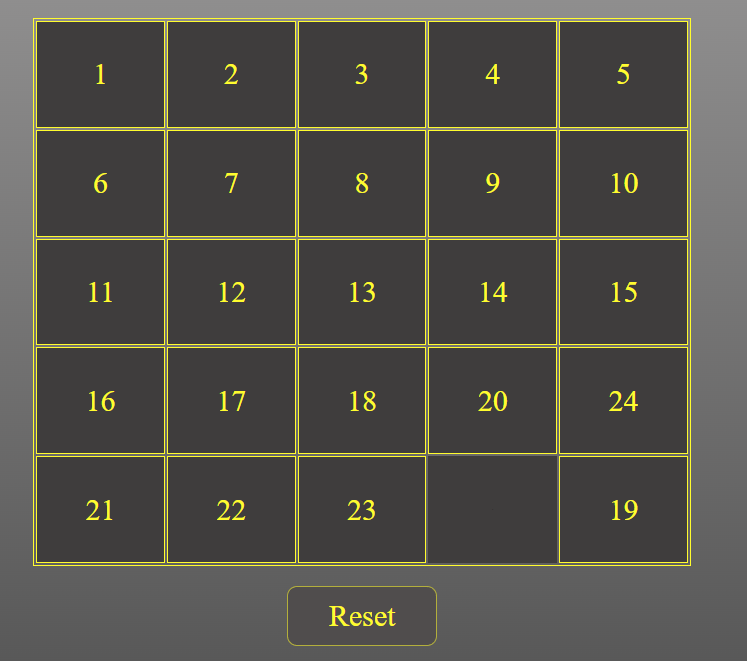

# Gra Taquin 5x5

## Opis
Gra Taquin to popularna łamigłówka, w której pole do gry jest podzielone na siatkę 5x5, a gracz musi przesuwać klocki, aby poukładać liczby od 1 do 24 w kolejności rosnącej. Jedno pole na planszy pozostaje puste, co pozwala na przemieszczanie klocków na puste miejsce.

## Demo
[Link do gry Taquin 5x5](https://tomaszgrobelski.github.io/Kostka-Taquin/kostka.html)

## Funkcje
Plansza 5x5 z losowo wymieszanymi liczbami od 1 do 24.
Możliwość przesuwania klocków w puste miejsce.
Sprawdzanie, czy puzzle zostało ułożone poprawnie.
Możliwość rozpoczęcia nowej gry.
Jak grać
Otwórz grę Taquin 5x5 na stronie [Kostka-Taquin](https://tomaszgrobelski.github.io/Kostka-Taquin/kostka.html)
Przesuwaj klocki, aby poukładać liczby od 1 do 24 w kolejności rosnącej.
Spróbuj ułożyć puzzle z jak najmniejszą liczbą ruchów i jak najszybciej.

## Technologie:
- HTML
- CSS
JavaScript. 
Instalacja i uruchamianie lokalnie:
Sklonuj to repozytorium:
bash =>
Copy code =>
git clone https://github.com/twoj-uzytkownik/taquin-5x5.git =>
Wejdź do folderu projektu:
bash =>
Copy code =>
cd taquin-5x5 =>
Otwórz plik index.html w przeglądarce.

## Autor:
Grobelski Tomasz

## Licencja:
Wyłącznie do użytku osobistego. Nie rozpowszechniaj.

